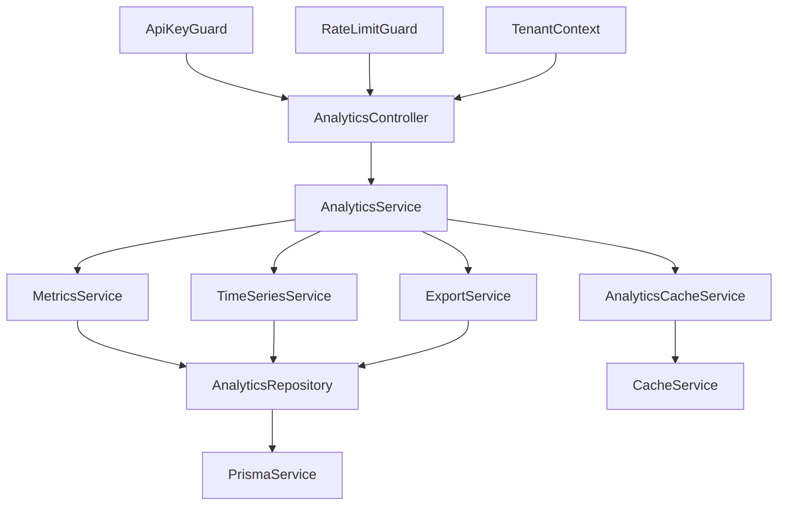

# Analytics Endpoints Basic - Technical Design Document

## Executive Summary

This design document outlines the implementation of foundational analytics endpoints for the Mercurio API, providing essential metrics and insights for traffic managers. The system leverages existing multi-tenant architecture patterns, implements comprehensive caching strategies, and ensures optimal performance through query optimization and proper data isolation.

### Key Design Decisions

- **Modular Architecture**: Create dedicated `AnalyticsModule` following existing NestJS patterns
- **Multi-Tenant Isolation**: Enforce tenant/workspace separation at all data access levels
- **Caching Strategy**: Implement Redis-backed caching with configurable TTLs for performance
- **Query Optimization**: Utilize existing database indexes and implement efficient aggregation patterns
- **Response Consistency**: Follow established API response patterns and error handling

### Performance Targets

- p50 response time < 100ms for all analytics endpoints
- p95 response time < 500ms for all analytics endpoints
- Support 100+ concurrent requests per workspace
- >90% cache hit rate for frequently accessed metrics

---

## System Architecture

### Module Structure

```
src/analytics/
├── analytics.module.ts           # Main module configuration
├── controllers/
│   └── analytics.controller.ts   # REST endpoints handler
├── services/
│   ├── analytics.service.ts      # Core analytics business logic
│   ├── metrics.service.ts        # Metric calculation service
│   ├── time-series.service.ts    # Time-series data processing
│   ├── export.service.ts         # Data export functionality
│   └── cache.service.ts          # Analytics-specific caching
├── dto/
│   ├── query.dto.ts              # Query parameter DTOs
│   └── response.dto.ts           # Response type definitions
├── repositories/
│   └── analytics.repository.ts   # Data access layer
├── types/
│   └── analytics.types.ts        # TypeScript type definitions
└── utils/
    ├── period.utils.ts           # Period calculation utilities
    ├── timezone.utils.ts         # Timezone conversion utilities
    └── aggregation.utils.ts      # Query aggregation helpers
```

### Integration with Existing Modules

The analytics module integrates with existing infrastructure:

- **CommonModule**: Authentication, rate limiting, logging services
- **PrismaService**: Database access with connection pooling
- **CacheService**: In-memory caching extended with Redis for analytics
- **ApiKeyGuard**: Authentication and scope validation
- **MetricsService**: Performance monitoring and observability

### Component Relationships



---

## Technical Specifications

### Core Analytics Service

```typescript
@Injectable()
export class AnalyticsService {
  constructor(
    private readonly analyticsRepository: AnalyticsRepository,
    private readonly metricsService: MetricsService,
    private readonly timeSeriesService: TimeSeriesService,
    private readonly cacheService: AnalyticsCacheService,
    private readonly logger: MercurioLogger,
  ) {}

  /**
   * Get overview metrics with caching
   */
  async getOverviewMetrics(
    tenantContext: TenantContext,
    query: OverviewQueryDto,
  ): Promise<OverviewMetricsResponse> {
    const cacheKey = this.buildCacheKey('overview', tenantContext, query);
    
    // Check cache first
    const cached = await this.cacheService.get<OverviewMetricsResponse>(cacheKey);
    if (cached) {
      this.logger.debug('Analytics overview cache hit', { cacheKey });
      return cached;
    }

    // Calculate metrics
    const metrics = await this.metricsService.calculateOverviewMetrics(
      tenantContext,
      query,
    );

    // Cache with appropriate TTL
    const ttl = this.getCacheTTL(query.period);
    await this.cacheService.set(cacheKey, metrics, ttl);

    return metrics;
  }
}
```

### Analytics Repository

```typescript
@Injectable()
export class AnalyticsRepository {
  constructor(private readonly prisma: PrismaService) {}

  /**
   * Get event aggregations with multi-tenant filtering
   */
  async getEventAggregations(
    tenantId: bigint,
    workspaceId: bigint,
    startDate: Date,
    endDate: Date,
    granularity?: 'hour' | 'day' | 'week',
  ): Promise<EventAggregation[]> {
    const timeGrouping = this.getTimeGrouping(granularity || 'day');
    
    return this.prisma.$queryRaw`
      SELECT 
        ${timeGrouping} as period,
        COUNT(*)::int as total_events,
        COUNT(DISTINCT anonymous_id)::int as unique_visitors,
        COUNT(DISTINCT session_id)::int as total_sessions,
        COUNT(DISTINCT CASE WHEN lead_id IS NOT NULL THEN anonymous_id END)::int as conversions
      FROM event
      WHERE tenant_id = ${tenantId}
        AND workspace_id = ${workspaceId}
        AND timestamp >= ${startDate}
        AND timestamp <= ${endDate}
      GROUP BY ${timeGrouping}
      ORDER BY period ASC
    `;
  }

  /**
   * Get top events with ranking and trends
   */
  async getTopEvents(
    tenantId: bigint,
    workspaceId: bigint,
    startDate: Date,
    endDate: Date,
    limit: number = 10,
  ): Promise<TopEventData[]> {
    return this.prisma.$queryRaw`
      WITH event_stats AS (
        SELECT 
          event_name,
          COUNT(*)::int as count,
          COUNT(DISTINCT anonymous_id)::int as unique_visitors,
          (COUNT(*)::decimal / COUNT(DISTINCT anonymous_id))::decimal(10,2) as avg_per_visitor
        FROM event
        WHERE tenant_id = ${tenantId}
          AND workspace_id = ${workspaceId}
          AND timestamp >= ${startDate}
          AND timestamp <= ${endDate}
        GROUP BY event_name
      ),
      total_events AS (
        SELECT SUM(count)::int as total FROM event_stats
      ),
      ranked_events AS (
        SELECT 
          event_name,
          count,
          unique_visitors,
          avg_per_visitor,
          ROW_NUMBER() OVER (ORDER BY count DESC) as rank,
          (count::decimal / total.total * 100)::decimal(5,2) as percentage
        FROM event_stats, total_events total
      )
      SELECT * FROM ranked_events
      ORDER BY rank ASC
      LIMIT ${limit}
    `;
  }
}
```

### Response DTOs and Types

```typescript
// src/analytics/dto/response.dto.ts

export interface PeriodInfo {
  type: '24h' | '7d' | '30d' | 'custom';
  start: string; // ISO8601
  end: string;   // ISO8601
  timezone: string;
  granularity?: 'hour' | 'day' | 'week';
}

export interface MetricComparison {
  value: number;
  change_pct: number;
  previous: number;
  direction?: 'up' | 'down' | 'stable';
}

export interface OverviewMetricsResponse {
  period: PeriodInfo;
  metrics: {
    total_events: number;
    unique_visitors: number;
    total_sessions: number;
    conversion_rate: number;
    bounce_rate: number;
    avg_session_duration: number;
    top_event: string;
  };
  comparisons: {
    total_events: MetricComparison;
    unique_visitors: MetricComparison;
    total_sessions: MetricComparison;
  };
}

export interface TimeSeriesDataPoint {
  timestamp: string; // ISO8601
  events?: number;
  visitors?: number;
  sessions?: number;
  conversions?: number;
}

export interface TimeSeriesResponse {
  period: PeriodInfo;
  data: TimeSeriesDataPoint[];
}

export interface EventTrendData {
  change_pct: number;
  direction: 'up' | 'down' | 'stable';
}

export interface TopEventItem {
  rank: number;
  event_name: string;
  count: number;
  percentage: number;
  unique_visitors: number;
  avg_per_visitor: number;
  trend: EventTrendData;
}

export interface TopEventsResponse {
  period: PeriodInfo;
  total_events: number;
  events: TopEventItem[];
}

export interface ActivityLevel {
  level: 'high_activity' | 'medium_activity' | 'low_activity';
  description: string;
  visitors: number;
  percentage: number;
  avg_events_per_session: number;
}

export interface ConversionStage {
  stage: string;
  count: number;
  percentage: number;
}

export interface ConversionFunnel {
  visitors: number;
  sessions_created: number;
  events_generated: number;
  leads_identified: number;
  conversion_stages: ConversionStage[];
}

export interface UserAnalyticsResponse {
  period: PeriodInfo;
  summary: {
    total_visitors: number;
    identified_leads: number;
    identification_rate: number;
    returning_visitors: number;
    new_visitors: number;
  };
  activity_levels: ActivityLevel[];
  conversion_funnel: ConversionFunnel;
}

export interface EventDetailItem {
  event_id: string;
  event_name: string;
  timestamp: string;
  anonymous_id: string;
  lead_id?: string;
  session_id?: string;
  page?: Record<string, any>;
  utm?: Record<string, any>;
  device?: Record<string, any>;
  geo?: Record<string, any>;
  props?: Record<string, any>;
}

export interface PaginationInfo {
  page: number;
  limit: number;
  total_events: number;
  total_pages: number;
  has_next: boolean;
  has_prev: boolean;
}

export interface EventDetailsResponse {
  pagination: PaginationInfo;
  filters: Record<string, any>;
  events: EventDetailItem[];
}

export interface ExportResponse {
  export_id: string;
  status: 'processing' | 'completed' | 'failed';
  created_at: string;
  download_url?: string;
  expires_at?: string;
  format: 'json' | 'csv';
  estimated_size?: string;
  record_count?: number;
}
```

### Query Parameter DTOs

```typescript
// src/analytics/dto/query.dto.ts

export class PeriodQueryDto {
  @IsEnum(['24h', '7d', '30d', 'custom'])
  @IsNotEmpty()
  period: '24h' | '7d' | '30d' | 'custom';

  @IsDateString()
  @ValidateIf((o) => o.period === 'custom')
  @IsNotEmpty()
  start_date?: string;

  @IsDateString()
  @ValidateIf((o) => o.period === 'custom')
  @IsNotEmpty()
  end_date?: string;

  @IsOptional()
  @IsString()
  @IsTimeZone()
  timezone?: string = 'UTC';

  @Transform(({ value }) => new Date(value))
  get startDate(): Date {
    return this.period === 'custom' 
      ? new Date(this.start_date!) 
      : this.getPeriodStartDate();
  }

  @Transform(({ value }) => new Date(value))
  get endDate(): Date {
    return this.period === 'custom' 
      ? new Date(this.end_date!) 
      : new Date();
  }

  private getPeriodStartDate(): Date {
    const now = new Date();
    switch (this.period) {
      case '24h': return new Date(now.getTime() - 24 * 60 * 60 * 1000);
      case '7d': return new Date(now.getTime() - 7 * 24 * 60 * 60 * 1000);
      case '30d': return new Date(now.getTime() - 30 * 24 * 60 * 60 * 1000);
      default: throw new Error('Invalid period');
    }
  }
}

export class TimeSeriesQueryDto extends PeriodQueryDto {
  @IsEnum(['hour', 'day', 'week'])
  @IsNotEmpty()
  granularity: 'hour' | 'day' | 'week';

  @IsArray()
  @IsEnum(['events', 'visitors', 'sessions', 'conversions'], { each: true })
  @IsNotEmpty()
  @Transform(({ value }) => Array.isArray(value) ? value : value.split(','))
  metrics: ('events' | 'visitors' | 'sessions' | 'conversions')[];
}

export class TopEventsQueryDto extends PeriodQueryDto {
  @IsOptional()
  @IsInt()
  @Min(1)
  @Max(100)
  @Transform(({ value }) => parseInt(value))
  limit?: number = 10;
}

export class UserAnalyticsQueryDto extends PeriodQueryDto {
  @IsOptional()
  @IsEnum(['all', 'visitors', 'leads'])
  segment?: 'all' | 'visitors' | 'leads' = 'all';
}

export class EventDetailsQueryDto extends PeriodQueryDto {
  @IsOptional()
  @IsString()
  event_name?: string;

  @IsOptional()
  @IsString()
  @Matches(/^a_[a-zA-Z0-9]+$/)
  anonymous_id?: string;

  @IsOptional()
  @IsString()
  @Matches(/^ld_[a-zA-Z0-9]+$/)
  lead_id?: string;

  @IsOptional()
  @IsString()
  @Matches(/^s_[a-zA-Z0-9]+$/)
  session_id?: string;

  @IsOptional()
  @IsBoolean()
  @Transform(({ value }) => value === 'true' || value === true)
  has_lead?: boolean;

  @IsOptional()
  @IsInt()
  @Min(1)
  @Transform(({ value }) => parseInt(value))
  page?: number = 1;

  @IsOptional()
  @IsInt()
  @Min(1)
  @Max(1000)
  @Transform(({ value }) => parseInt(value))
  limit?: number = 50;

  @IsOptional()
  @IsEnum(['timestamp', 'event_name'])
  sort_by?: 'timestamp' | 'event_name' = 'timestamp';

  @IsOptional()
  @IsEnum(['asc', 'desc'])
  sort_order?: 'asc' | 'desc' = 'desc';
}

export class ExportRequestDto extends PeriodQueryDto {
  @IsEnum(['events', 'overview', 'timeseries', 'users'])
  @IsNotEmpty()
  dataset: 'events' | 'overview' | 'timeseries' | 'users';

  @IsEnum(['json', 'csv'])
  @IsNotEmpty()
  format: 'json' | 'csv';

  @IsOptional()
  @IsObject()
  filters?: Record<string, any>;
}
```

---

## Data Model

### Database Queries and Optimization

The analytics endpoints leverage existing database schema with strategic query optimization:

#### Existing Indexes Utilization

```sql
-- Primary analytics queries use these existing indexes:
-- @@index([tenantId, workspaceId, timestamp])           -- Time-range queries
-- @@index([tenantId, workspaceId, anonymousId, timestamp]) -- User journey queries  
-- @@index([tenantId, workspaceId, eventName, timestamp])   -- Event-specific queries
-- @@index([tenantId, workspaceId, leadId, timestamp])      -- Conversion queries
```

#### Optimized Aggregation Queries

```typescript
// Time-series aggregation with proper indexing
export class AnalyticsRepository {
  async getTimeSeriesData(
    tenantId: bigint,
    workspaceId: bigint,
    startDate: Date,
    endDate: Date,
    granularity: 'hour' | 'day' | 'week',
    metrics: string[],
  ): Promise<TimeSeriesDataPoint[]> {
    const timeFormat = this.getTimeFormat(granularity);
    const metricSelections = this.buildMetricSelections(metrics);
    
    // Optimized query using existing indexes
    return this.prisma.$queryRaw`
      WITH time_series AS (
        SELECT generate_series(
          date_trunc(${granularity}, ${startDate}::timestamp),
          date_trunc(${granularity}, ${endDate}::timestamp),
          '1 ${granularity}'::interval
        ) AS timestamp
      ),
      event_aggregations AS (
        SELECT 
          date_trunc(${granularity}, timestamp) as period,
          ${Prisma.raw(metricSelections)}
        FROM event
        WHERE tenant_id = ${tenantId}
          AND workspace_id = ${workspaceId}
          AND timestamp >= ${startDate}
          AND timestamp <= ${endDate}
        GROUP BY date_trunc(${granularity}, timestamp)
      )
      SELECT 
        time_series.timestamp,
        COALESCE(${Prisma.raw(this.buildCoalesceSelections(metrics))})
      FROM time_series
      LEFT JOIN event_aggregations ON time_series.timestamp = event_aggregations.period
      ORDER BY time_series.timestamp ASC
    `;
  }
}
```

#### User Analytics Segmentation

```typescript
async getUserActivityLevels(
  tenantId: bigint,
  workspaceId: bigint,
  startDate: Date,
  endDate: Date,
): Promise<ActivityLevel[]> {
  return this.prisma.$queryRaw`
    WITH session_activity AS (
      SELECT 
        s.anonymous_id,
        COUNT(e.id)::int as events_per_session
      FROM session s
      LEFT JOIN event e ON s.session_id = e.session_id 
        AND e.tenant_id = s.tenant_id 
        AND e.workspace_id = s.workspace_id
      WHERE s.tenant_id = ${tenantId}
        AND s.workspace_id = ${workspaceId}
        AND s.started_at >= ${startDate}
        AND s.started_at <= ${endDate}
      GROUP BY s.anonymous_id, s.session_id
    ),
    activity_classification AS (
      SELECT 
        anonymous_id,
        events_per_session,
        CASE 
          WHEN events_per_session >= 10 THEN 'high_activity'
          WHEN events_per_session >= 3 THEN 'medium_activity'
          ELSE 'low_activity'
        END as activity_level
      FROM session_activity
    ),
    activity_summary AS (
      SELECT 
        activity_level,
        COUNT(DISTINCT anonymous_id)::int as visitors,
        AVG(events_per_session)::decimal(10,2) as avg_events_per_session
      FROM activity_classification
      GROUP BY activity_level
    ),
    total_visitors AS (
      SELECT COUNT(DISTINCT anonymous_id)::int as total FROM activity_classification
    )
    SELECT 
      activity_level as level,
      visitors,
      (visitors::decimal / total.total * 100)::decimal(5,2) as percentage,
      avg_events_per_session
    FROM activity_summary, total_visitors total
    ORDER BY 
      CASE activity_level
        WHEN 'high_activity' THEN 1
        WHEN 'medium_activity' THEN 2
        WHEN 'low_activity' THEN 3
      END
  `;
}
```

---

## User Experience Design

### API Endpoint Structure

All analytics endpoints follow consistent patterns:

```
GET  /v1/analytics/overview           # Overview metrics
GET  /v1/analytics/timeseries         # Time-series data
GET  /v1/analytics/events/top         # Top events ranking
GET  /v1/analytics/users              # User analytics
GET  /v1/analytics/events/details     # Event details with filtering
POST /v1/analytics/export             # Export functionality
GET  /v1/analytics/export/{id}/download # Download exported data
```

### Response Format Consistency

All responses follow established Mercurio API patterns:

```typescript
// Success responses
{
  "period": { "type": "7d", "start": "...", "end": "...", "timezone": "UTC" },
  "data": { /* endpoint-specific data */ }
}

// Error responses
{
  "error": {
    "code": "validation_failed",
    "message": "Invalid period parameter",
    "details": {
      "field": "period",
      "received": "invalid",
      "expected": ["24h", "7d", "30d", "custom"]
    }
  }
}
```

### Input Validation and Error Handling

```typescript
@Controller('analytics')
@UseGuards(ApiKeyGuard, RateLimitGuard)
@RequireScopes(['analytics:read'])
export class AnalyticsController {
  @Get('overview')
  async getOverview(
    @CurrentTenant() tenant: TenantContext,
    @Query() query: OverviewQueryDto,
  ): Promise<OverviewMetricsResponse> {
    try {
      this.validateDateRange(query.startDate, query.endDate);
      return await this.analyticsService.getOverviewMetrics(tenant, query);
    } catch (error) {
      if (error instanceof ValidationException) {
        throw new BadRequestException({
          error: {
            code: 'validation_failed',
            message: error.message,
            details: error.details,
          },
        });
      }
      throw error;
    }
  }

  private validateDateRange(startDate: Date, endDate: Date): void {
    const maxRangeMs = 365 * 24 * 60 * 60 * 1000; // 1 year
    const rangeMs = endDate.getTime() - startDate.getTime();
    
    if (rangeMs > maxRangeMs) {
      throw new ValidationException('Date range cannot exceed 1 year', {
        field: 'date_range',
        max_days: 365,
        requested_days: Math.ceil(rangeMs / (24 * 60 * 60 * 1000)),
      });
    }

    if (startDate >= endDate) {
      throw new ValidationException('Start date must be before end date', {
        field: 'date_range',
        start_date: startDate.toISOString(),
        end_date: endDate.toISOString(),
      });
    }
  }
}
```

---

## Security & Privacy

### Multi-Tenant Data Isolation

All analytics queries enforce strict tenant isolation:

```typescript
@Injectable()
export class AnalyticsService {
  private async validateTenantAccess(
    tenantContext: TenantContext,
    query: any,
  ): Promise<void> {
    // All queries MUST include tenant and workspace filters
    if (!tenantContext.tenantId || !tenantContext.workspaceId) {
      throw new ForbiddenException('Invalid tenant context');
    }

    // Log analytics access for audit
    this.logger.audit('Analytics query executed', {
      tenantId: tenantContext.tenantId,
      workspaceId: tenantContext.workspaceId,
      endpoint: query.constructor.name,
      apiKeyId: tenantContext.apiKeyId,
    });
  }
}
```

### API Key Scope Requirements

```typescript
// Analytics endpoints require specific scopes
@RequireScopes(['analytics:read'])          // Basic read access
@RequireScopes(['analytics:export'])        // Export functionality  
@RequireScopes(['analytics:read', 'data:export']) // Alternative scope combinations
```

### Data Anonymization

```typescript
// PII protection in analytics responses
export class AnalyticsTransformService {
  transformEventDetails(events: EventDetailItem[]): EventDetailItem[] {
    return events.map(event => ({
      ...event,
      // Never expose encrypted PII in analytics
      lead_id: event.lead_id ? this.hashLeadId(event.lead_id) : undefined,
      // Anonymize IP addresses in geo data
      geo: event.geo ? this.anonymizeGeoData(event.geo) : undefined,
    }));
  }

  private anonymizeGeoData(geo: any): any {
    return {
      country: geo.country,
      region: geo.region,
      city: geo.city,
      // Remove IP address and precise coordinates
    };
  }
}
```

---

## Performance & Scalability

### Caching Strategy

Multi-layer caching approach for optimal performance:

```typescript
@Injectable()
export class AnalyticsCacheService {
  private readonly cachePrefix = 'analytics';
  
  constructor(
    private readonly redisService: RedisService,
    private readonly localCache: CacheService,
  ) {}

  async get<T>(key: string): Promise<T | null> {
    // L1: Local cache (fastest)
    const localResult = this.localCache.get<T>(this.buildKey(key));
    if (localResult) {
      return localResult;
    }

    // L2: Redis cache (shared across instances)
    const redisResult = await this.redisService.get(this.buildKey(key));
    if (redisResult) {
      const parsed = JSON.parse(redisResult) as T;
      // Store in local cache for subsequent requests
      this.localCache.set(this.buildKey(key), parsed, this.getLocalTTL());
      return parsed;
    }

    return null;
  }

  async set<T>(key: string, value: T, ttlMs: number): Promise<void> {
    const serialized = JSON.stringify(value);
    const fullKey = this.buildKey(key);

    // Store in both layers
    await Promise.all([
      this.redisService.setex(fullKey, Math.floor(ttlMs / 1000), serialized),
      this.localCache.set(fullKey, value, Math.min(ttlMs, this.getLocalTTL())),
    ]);
  }

  private getCacheTTL(period: string): number {
    // Dynamic TTL based on data freshness requirements
    switch (period) {
      case '24h': return 5 * 60 * 1000;  // 5 minutes
      case '7d': return 15 * 60 * 1000;  // 15 minutes  
      case '30d': return 60 * 60 * 1000; // 1 hour
      case 'custom': return 30 * 60 * 1000; // 30 minutes
      default: return 15 * 60 * 1000;
    }
  }
}
```

### Query Optimization Patterns

```typescript
export class QueryOptimizer {
  /**
   * Build efficient aggregation queries with proper index usage
   */
  buildOptimizedEventQuery(
    tenantId: bigint,
    workspaceId: bigint,
    filters: EventFilters,
  ): string {
    const baseQuery = `
      SELECT /* Analytics Query - Use tenant_workspace_timestamp index */
        ${this.selectClause(filters)}
      FROM event
      WHERE tenant_id = ${tenantId}
        AND workspace_id = ${workspaceId}
        AND timestamp >= $startDate
        AND timestamp <= $endDate
    `;

    // Add additional filters that can use existing indexes
    const additionalFilters = [];
    
    if (filters.eventName) {
      // Uses tenant_workspace_eventname_timestamp index
      additionalFilters.push(`AND event_name = '${filters.eventName}'`);
    }

    if (filters.anonymousId) {
      // Uses tenant_workspace_anonymousid_timestamp index
      additionalFilters.push(`AND anonymous_id = '${filters.anonymousId}'`);
    }

    if (filters.hasLead !== undefined) {
      // Uses tenant_workspace_leadid_timestamp index when filtering by lead
      additionalFilters.push(
        filters.hasLead 
          ? `AND lead_id IS NOT NULL`
          : `AND lead_id IS NULL`
      );
    }

    return baseQuery + additionalFilters.join(' ');
  }

  /**
   * Prevent N+1 queries by using efficient batch operations
   */
  async batchLoadEventDetails(
    eventIds: string[],
    tenantId: bigint,
    workspaceId: bigint,
  ): Promise<EventDetailItem[]> {
    // Single query to load all event details
    return this.prisma.event.findMany({
      where: {
        id: { in: eventIds },
        tenantId,
        workspaceId,
      },
      select: {
        eventId: true,
        eventName: true,
        timestamp: true,
        anonymousId: true,
        leadId: true,
        sessionId: true,
        page: true,
        utm: true,
        device: true,
        geo: true,
        props: true,
      },
      orderBy: { timestamp: 'desc' },
    });
  }
}
```

### Resource Management

```typescript
@Injectable()
export class AnalyticsResourceManager {
  private readonly maxConcurrentQueries = parseInt(
    process.env.ANALYTICS_MAX_CONCURRENT_QUERIES || '10'
  );
  
  private activeSemaphore = new Semaphore(this.maxConcurrentQueries);

  async executeWithResourceLimit<T>(
    operation: () => Promise<T>,
    context: string,
  ): Promise<T> {
    const permit = await this.activeSemaphore.acquire();
    const startTime = Date.now();
    
    try {
      this.logger.debug(`Analytics operation started: ${context}`);
      return await operation();
    } finally {
      permit.release();
      const duration = Date.now() - startTime;
      this.logger.debug(`Analytics operation completed: ${context}`, { duration });
      
      // Track performance metrics
      this.metricsService.recordLatency(`analytics.${context}_duration`, duration);
    }
  }
}
```

---

## Integration Points

### Export Service Integration

```typescript
@Injectable()
export class ExportService {
  constructor(
    private readonly analyticsService: AnalyticsService,
    private readonly storageService: StorageService,
    private readonly queueService: QueueService,
  ) {}

  async createExport(
    tenantContext: TenantContext,
    request: ExportRequestDto,
  ): Promise<ExportResponse> {
    const exportId = `exp_${generateId()}`;
    
    // Create export job
    const job = {
      exportId,
      tenantContext,
      request,
      status: 'processing' as const,
      createdAt: new Date(),
    };

    // Queue for async processing
    await this.queueService.add('analytics-export', job);

    return {
      export_id: exportId,
      status: 'processing',
      created_at: job.createdAt.toISOString(),
      format: request.format,
    };
  }

  @Process('analytics-export')
  async processExport(job: Job): Promise<void> {
    const { exportId, tenantContext, request } = job.data;
    
    try {
      // Get data based on dataset type
      const data = await this.getExportData(tenantContext, request);
      
      // Convert to requested format
      const content = request.format === 'csv' 
        ? this.convertToCSV(data)
        : JSON.stringify(data, null, 2);
      
      // Upload to secure storage
      const downloadUrl = await this.storageService.upload(
        `exports/${exportId}.${request.format}`,
        content,
        { expiresIn: '24h' }
      );

      // Update export status
      await this.updateExportStatus(exportId, 'completed', {
        downloadUrl,
        estimatedSize: this.formatBytes(Buffer.byteLength(content)),
        recordCount: Array.isArray(data) ? data.length : 1,
      });
      
    } catch (error) {
      await this.updateExportStatus(exportId, 'failed', { error: error.message });
      throw error;
    }
  }
}
```

### Monitoring Integration

```typescript
@Injectable()
export class AnalyticsMonitoringService {
  constructor(private readonly metricsService: MetricsService) {}

  recordAnalyticsMetrics(
    endpoint: string,
    duration: number,
    tenantId: string,
    cacheHit: boolean,
    resultCount?: number,
  ): void {
    // Record performance metrics
    this.metricsService.recordLatency(`analytics.${endpoint}.duration`, duration);
    this.metricsService.recordCounter(`analytics.${endpoint}.requests`, 1, {
      tenant_id: tenantId,
      cache_hit: cacheHit.toString(),
    });

    if (resultCount !== undefined) {
      this.metricsService.recordGauge(`analytics.${endpoint}.result_count`, resultCount);
    }

    // Alert on performance degradation
    if (duration > 1000) { // > 1 second
      this.metricsService.recordCounter('analytics.slow_query', 1, {
        endpoint,
        tenant_id: tenantId,
      });
    }
  }
}
```

---

## Implementation Plan

### Phase 1: Foundation (Week 1)

#### ANLT-001: Analytics Module Structure
- Create `AnalyticsModule` with base service and controller
- Set up dependency injection with existing services
- Implement basic authentication and rate limiting integration

#### ANLT-002: Overview Metrics Implementation
- Implement `getOverviewMetrics` endpoint with caching
- Create efficient database queries using existing indexes
- Add comprehensive input validation and error handling

#### ANLT-003: Core Infrastructure
- Implement `AnalyticsCacheService` with Redis integration
- Create timezone conversion utilities
- Set up analytics-specific logging and monitoring

### Phase 2: Core Analytics (Week 2)

#### ANLT-006: Time-Series Data Endpoint
- Implement `getTimeSeriesData` with granularity support
- Optimize queries for different time ranges and metrics
- Add response data formatting and validation

#### ANLT-007: Top Events Ranking
- Implement event ranking with trend calculations
- Create efficient aggregation queries with proper indexing
- Add period-over-period comparison logic

#### ANLT-008: User Analytics
- Implement user activity level segmentation
- Create conversion funnel calculations
- Add visitor vs lead analytics differentiation

### Phase 3: Advanced Features (Week 3)

#### ANLT-011: Event Details with Filtering
- Implement advanced event filtering with pagination
- Optimize database queries for large result sets
- Add proper data anonymization for PII protection

#### ANLT-012: Export Functionality
- Implement async export processing with job queues
- Create CSV/JSON format conversion utilities
- Set up secure file storage and download links

#### ANLT-013: Performance Optimization
- Implement query optimization strategies
- Add comprehensive caching with cache warming
- Create performance monitoring and alerting

### Phase 4: Testing & Documentation

#### ANLT-014: Comprehensive Testing
- Create unit tests for all service methods (>90% coverage)
- Implement integration tests for multi-tenant scenarios
- Add load testing for performance validation

#### ANLT-015: Documentation & Deployment
- Complete API documentation with examples
- Create Postman collection for endpoint testing
- Finalize deployment configuration and monitoring

---

## Risk Assessment

### Technical Risks & Mitigation

| Risk | Impact | Probability | Mitigation Strategy |
|------|--------|-------------|-------------------|
| **Query Performance Degradation** | High | Medium | - Implement query optimization with proper indexing<br>- Add query result caching with appropriate TTLs<br>- Monitor slow query logs and optimize problematic queries<br>- Implement query timeouts and resource limits |
| **Large Result Sets Memory Issues** | Medium | High | - Implement pagination for all list endpoints<br>- Use streaming for large exports<br>- Set maximum result limits with validation<br>- Monitor memory usage and implement circuit breakers |
| **Cache Inconsistency** | Medium | Low | - Implement proper cache invalidation strategies<br>- Use cache versioning for schema changes<br>- Monitor cache hit rates and data freshness<br>- Implement cache warming for critical metrics |
| **Multi-Tenant Data Leakage** | High | Low | - Enforce tenant isolation at all query levels<br>- Implement comprehensive integration tests<br>- Add audit logging for all data access<br>- Regular security reviews and penetration testing |

### Performance Risk Mitigation

```typescript
@Injectable()
export class PerformanceGuardService {
  private readonly maxQueryTimeMs = 30000; // 30 seconds
  private readonly maxResultSetSize = 100000; // 100k records
  
  async executeWithTimeout<T>(
    operation: () => Promise<T>,
    timeoutMs: number = this.maxQueryTimeMs,
  ): Promise<T> {
    return Promise.race([
      operation(),
      new Promise<never>((_, reject) =>
        setTimeout(() => reject(new Error('Query timeout')), timeoutMs)
      ),
    ]);
  }

  validateResultSize(count: number): void {
    if (count > this.maxResultSetSize) {
      throw new Error(`Result set too large: ${count} > ${this.maxResultSetSize}`);
    }
  }
}
```

---

## Success Metrics

### Technical KPIs

- **Response Time**: p50 < 100ms, p95 < 500ms achieved consistently
- **Cache Hit Rate**: >90% for frequently accessed metrics
- **Query Performance**: All database queries complete within 10 seconds
- **Error Rate**: <1% error rate across all analytics endpoints
- **Test Coverage**: >90% code coverage with comprehensive integration tests

### Business KPIs

- **API Adoption**: >80% of active workspaces use analytics endpoints within 30 days
- **Query Volume**: Support 10,000+ analytics queries per day
- **User Satisfaction**: Positive feedback on data accuracy and response times
- **Export Usage**: Export functionality used by >50% of workspaces

### Monitoring Dashboard

```typescript
export interface AnalyticsDashboardMetrics {
  performance: {
    avgResponseTime: number;
    p95ResponseTime: number;
    requestsPerSecond: number;
    errorRate: number;
  };
  caching: {
    hitRate: number;
    missRate: number;
    evictionRate: number;
    memoryUsage: number;
  };
  database: {
    queryDuration: number;
    connectionPoolUsage: number;
    slowQueryCount: number;
  };
  business: {
    dailyActiveWorkspaces: number;
    totalQueriesProcessed: number;
    exportJobsCompleted: number;
    dataAccuracy: number;
  };
}
```

This comprehensive design document provides the foundation for implementing robust analytics endpoints that meet the performance, security, and scalability requirements of the Mercurio platform while following established architectural patterns and best practices.