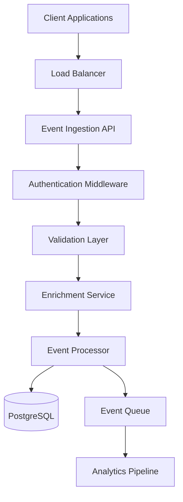

# Event Ingestion API Design Document

## Overview

The Event Ingestion API is a high-performance, multi-tenant system designed to capture, validate, and process behavioral analytics events from web and mobile applications. Built on NestJS with Fastify, the system handles three primary ingestion patterns: real-time single events, batch processing, and user identification. The architecture emphasizes data integrity, security, and scalability while maintaining sub-100ms response times for event ingestion.

The system integrates with the existing Mercurio database schema, leveraging the multi-tenant architecture with proper data isolation and the established identity resolution system linking anonymous visitors to identified leads.

## Architecture

### High-Level Architecture



### Request Flow

1. **Authentication Layer**: Validates API keys and resolves tenant/workspace context
2. **Validation Layer**: Schema validation using AJV for performance
3. **Enrichment Layer**: Adds server-side metadata (timestamps, IP, user agent)
4. **Processing Layer**: Handles visitor/session logic and data persistence
5. **Response Layer**: Returns structured responses with processing status

### Multi-Tenant Isolation

All event data is isolated by `tenant_id` and `workspace_id` at the database level. API keys are scoped to specific workspaces, ensuring complete data isolation between tenants.

## Components and Interfaces

### 1. Authentication Module

**Purpose**: Handle API key validation and tenant resolution

**Components**:
- `ApiKeyGuard`: NestJS guard for request authentication
- `ApiKeyService`: Service for key validation and tenant lookup
- `TenantContext`: Request-scoped context holding tenant/workspace info

**Key Methods**:
```typescript
interface ApiKeyService {
  validateKey(keyHash: string): Promise<ApiKeyValidationResult>
  updateLastUsed(keyId: bigint): Promise<void>
}

interface ApiKeyValidationResult {
  isValid: boolean
  tenantId?: bigint
  workspaceId?: bigint
  scopes: string[]
  revokedAt?: Date
}
```

### 2. Validation Module

**Purpose**: Schema validation and input sanitization

**Components**:
- `EventSchemaValidator`: AJV-based schema validation
- `BatchValidator`: Batch-specific validation logic
- `IdentifyValidator`: User identification data validation

**Schemas**:
- Track Event Schema: `event_name`, `timestamp`, `anonymous_id`, optional `properties`
- Batch Schema: Array of track events with size limits
- Identify Schema: `anonymous_id`, `user_id`, `traits` object

### 3. Enrichment Service

**Purpose**: Add server-side metadata to events

**Enrichment Data**:
- `ingested_at`: Server timestamp
- `ip_address`: Client IP address
- `user_agent`: Raw browser/device information
- `schema_version`: Current event schema version
- `geo`: Enriched geolocation data from IP
- `device`: Parsed device/OS/browser information
- `utm_normalized`: Standardized UTM parameters

**Geolocation Enrichment**:
```typescript
interface GeoEnrichmentResult {
  country: string
  region?: string
  city?: string
  timezone?: string
  lat?: number
  lng?: number
}
```

**Device Information Parsing**:
```typescript
interface DeviceInfo {
  type: 'desktop' | 'mobile' | 'tablet' | 'unknown'
  os: {
    name: string
    version?: string
  }
  browser: {
    name: string
    version?: string
  }
}
```

### 4. Event Processing Service

**Purpose**: Core business logic for event handling

**Key Responsibilities**:
- Visitor management (create/update visitor records)
- Session tracking and timeout handling
- Identity resolution and linking
- Event persistence with proper indexing

**Key Methods**:
```typescript
interface EventProcessor {
  processTrackEvent(event: TrackEventDto, context: TenantContext): Promise<ProcessingResult>
  processBatchEvents(events: TrackEventDto[], context: TenantContext): Promise<BatchProcessingResult>
  processIdentifyEvent(identify: IdentifyEventDto, context: TenantContext): Promise<ProcessingResult>
}
```

### 5. Session Management Service

**Purpose**: Handle visitor sessions and timeouts

**Session Logic**:
- Session timeout: 30 minutes of inactivity
- Session ID generation: `s_` prefix with ULID
- Automatic session creation for new visitors
- Session end detection and cleanup

### 6. Identity Resolution Service

**Purpose**: Link anonymous visitors to identified users

**Resolution Logic**:
- Create/update Lead records with encrypted PII
- Maintain IdentityLink relationships
- Handle identity merging scenarios
- Support trait updates and profile enrichment

## Data Models

### Event Data Transfer Objects

```typescript
// Track Event DTO
interface TrackEventDto {
  event_name: string
  timestamp: string // ISO-8601
  anonymous_id: string // a_xxxxx format
  session_id?: string // s_xxxxx format
  properties?: Record<string, any>
  page?: {
    url: string
    title?: string
    referrer?: string
  }
  utm?: {
    source?: string
    medium?: string
    campaign?: string
    term?: string
    content?: string
  }
}

// Batch Event DTO
interface BatchEventDto {
  events: TrackEventDto[]
}

// Identify Event DTO
interface IdentifyEventDto {
  anonymous_id: string
  user_id?: string
  traits?: Record<string, any>
  timestamp?: string
}
```

### Response Models

```typescript
// Single Event Response
interface EventResponse {
  accepted: boolean
  event_id?: string
  errors?: ValidationError[]
}

// Batch Response
interface BatchResponse {
  accepted: number
  rejected: number
  results: EventResponse[]
  errors?: ValidationError[]
}

// Identify Response
interface IdentifyResponse {
  accepted: boolean
  lead_id?: string
  errors?: ValidationError[]
}
```

### Database Interactions

The system interacts with existing Prisma models:
- `Visitor`: Anonymous visitor tracking
- `Lead`: Identified user profiles
- `IdentityLink`: Visitor-to-lead relationships
- `Session`: User session management
- `Event`: Event storage with full metadata
- `ApiKey`: Authentication and authorization

## Error Handling

### Error Categories

1. **Authentication Errors** (401)
   - Invalid API key
   - Revoked API key
   - Missing authentication

2. **Validation Errors** (400)
   - Schema validation failures
   - Missing required fields
   - Invalid data types
   - Payload size limits

3. **Rate Limiting Errors** (429)
   - API key rate limits exceeded
   - Tenant-level rate limits
   - Global system limits

4. **Server Errors** (500)
   - Database connection failures
   - Processing pipeline errors
   - Unexpected system errors

### Error Response Format

Following the API style guide:

```typescript
interface ErrorResponse {
  error: {
    code: string
    message: string
    details?: any
  }
}
```

### Error Codes

- `unauthorized`: Invalid or missing API key
- `invalid_schema`: Schema validation failure
- `payload_too_large`: Request exceeds size limits
- `rate_limited`: Rate limit exceeded
- `replay_detected`: Duplicate event detection
- `invalid_timestamp`: Timestamp outside acceptable range
- `internal_error`: Unexpected server error

### Retry Logic

- **Client Errors (4xx)**: No retry recommended
- **Server Errors (5xx)**: Exponential backoff with jitter
- **Rate Limits (429)**: Respect `Retry-After` header
- **Timeouts**: Linear backoff with circuit breaker

## Testing Strategy

### Unit Tests

**Validation Layer**:
- Schema validation with valid/invalid payloads
- Edge cases for data types and formats
- Sanitization and security validation

**Processing Logic**:
- Visitor creation and updates
- Session management and timeouts
- Identity resolution scenarios
- Event enrichment and metadata

**Authentication**:
- API key validation flows
- Tenant context resolution
- Permission and scope checking

### Integration Tests

**API Endpoints**:
- Full request/response cycles
- Database persistence verification
- Multi-tenant data isolation
- Error handling and status codes

**Database Operations**:
- Event insertion with proper indexing
- Visitor and session management
- Identity linking operations
- Transaction handling and rollbacks

### Performance Tests

**Load Testing**:
- Single event ingestion: Target 1000+ RPS
- Batch processing: 10,000+ events/batch
- Concurrent tenant isolation
- Memory and CPU usage under load

**Stress Testing**:
- Database connection pool limits
- Memory usage with large payloads
- Error handling under extreme load
- Recovery after system stress

### Contract Tests

**Schema Validation**:
- Event schema compliance
- API response format validation
- Error response structure
- Backward compatibility testing

## Security Considerations

### API Key Management

- Keys stored as SHA-256 hashes
- Scoped permissions per workspace
- Automatic key rotation support
- Usage tracking and anomaly detection

### Input Validation

- Strict schema validation with AJV
- Input sanitization for XSS prevention
- Size limits on all payloads
- Rejection of unknown fields in strict mode

### Rate Limiting

- Per-API-key rate limits
- Tenant-level aggregate limits
- Global system protection
- Sliding window implementation

### Data Privacy

- No PII in event properties validation
- Encrypted storage for identified user data
- Audit logging for data access
- GDPR compliance for data retention

### Anti-Replay Protection

- Timestamp validation (±5 minutes window)
- Optional nonce support for client-side keys
- Event deduplication by `event_id`
- Request signature validation for server-side

### Schema Versioning

**Version Strategy**:
- Header-based versioning: `X-Event-Schema-Version: 1.0`
- Backward compatibility for N-1 versions
- Graceful degradation for unknown versions

**Version Resolution**:
```typescript
interface SchemaVersioning {
  supportedVersions: string[]
  defaultVersion: string
  resolveSchema(version?: string): EventSchema
  migrateEvent(event: any, fromVersion: string, toVersion: string): any
}
```

**Migration Support**:
- Automatic field mapping for minor version changes
- Deprecation warnings for outdated schemas
- Breaking change notifications with migration guides

### Observability and Metrics

**System Metrics**:
- Request throughput (events/second)
- Response latency (p50, p95, p99)
- Error rates by error type
- Database connection pool utilization
- Memory and CPU usage

**Business Metrics**:
- Events per tenant/workspace
- API key usage patterns
- Event type distribution
- Geographic distribution of events
- Session duration and frequency

**Distributed Tracing**:
```typescript
interface TracingContext {
  traceId: string
  spanId: string
  parentSpanId?: string
  tenantId: bigint
  workspaceId: bigint
  apiKeyId: bigint
}
```

**Structured Logging**:
```typescript
interface EventLogContext {
  traceId: string
  tenantId: bigint
  workspaceId: bigint
  eventName?: string
  anonymousId?: string
  sessionId?: string
  processingTimeMs: number
  success: boolean
  errorCode?: string
}
```

## Performance Optimizations

### Database Optimizations

- Prepared statements for common queries
- Connection pooling with proper sizing
- Batch inserts for multiple events
- Proper indexing strategy for time-series data

### Caching Strategy

- API key validation caching (5-minute TTL)
- Visitor session caching for active users
- Schema compilation caching
- Tenant configuration caching

### Async Processing

- Event queue for non-critical processing
- Background session cleanup
- Async identity resolution
- Metrics aggregation pipeline

### Memory Management

- Streaming JSON parsing for large payloads
- Object pooling for frequent allocations
- Garbage collection tuning
- Memory leak detection and monitoring