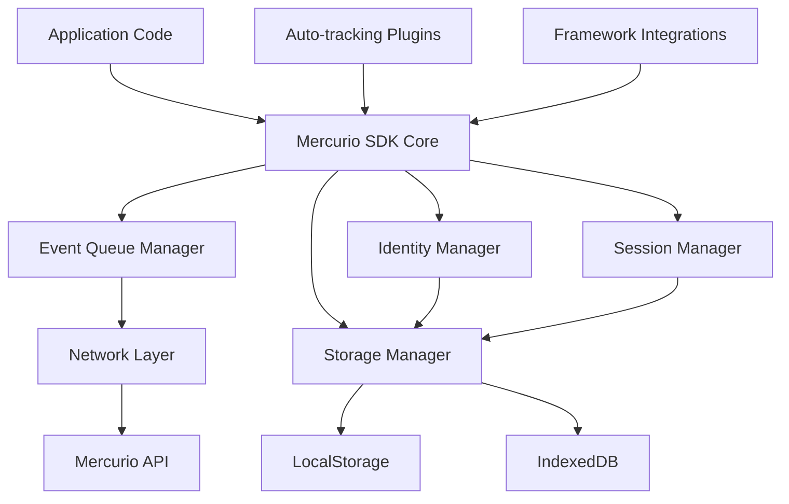

# Design Document - JavaScript SDK

## Overview

O JavaScript SDK do Mercurio é uma biblioteca client-side que oferece uma API simples e poderosa para tracking de eventos, identificação de usuários e análise de comportamento. O SDK é projetado para ser leve, performático e oferecer uma excelente experiência para desenvolvedores, competindo diretamente com soluções como Google Analytics, Mixpanel e Segment.

### Key Design Principles

- **Developer First**: API intuitiva e documentação clara
- **Performance Optimized**: Bundle pequeno (<10kb) com carregamento assíncrono
- **Privacy Focused**: Compliance com LGPD/GDPR por design
- **Framework Agnostic**: Funciona com qualquer stack JavaScript
- **Offline Resilient**: Queue local com retry automático

## Architecture

### High-Level Architecture



### Core Components

#### 1. SDK Core (`MercurioSDK`)
- **Responsibility**: Coordenação central, inicialização e configuração
- **Key Methods**: `init()`, `track()`, `identify()`, `page()`
- **Dependencies**: Todos os outros managers

#### 2. Event Queue Manager (`EventQueue`)
- **Responsibility**: Gerenciamento de fila de eventos, batching e retry
- **Features**: Batching inteligente, retry com backoff, persistência offline
- **Storage**: IndexedDB para eventos offline, memory queue para eventos ativos

#### 3. Identity Manager (`IdentityManager`)
- **Responsibility**: Gerenciamento de visitor ID, user ID e traits
- **Features**: Visitor ID persistente, user identification, traits storage
- **Storage**: LocalStorage para persistência de identidade

#### 4. Session Manager (`SessionManager`)
- **Responsibility**: Controle de sessões, timeout e renovação
- **Features**: Session timeout automático, session ID generation
- **Storage**: SessionStorage para dados da sessão atual

#### 5. Storage Manager (`StorageManager`)
- **Responsibility**: Abstração de storage com fallbacks
- **Features**: LocalStorage, SessionStorage, IndexedDB com fallbacks
- **Fallbacks**: Memory storage quando storage não está disponível

#### 6. Network Layer (`NetworkClient`)
- **Responsibility**: Comunicação com a API do Mercurio
- **Features**: Request batching, retry logic, error handling
- **Endpoints**: `/v1/events/track`, `/v1/events/batch`, `/v1/events/identify`

## Components and Interfaces

### Core SDK Interface

```typescript
interface MercurioSDK {
  // Initialization
  init(apiKey: string, options?: MercurioOptions): Promise<void>
  
  // Event tracking
  track(eventName: string, properties?: EventProperties): Promise<void>
  page(properties?: PageProperties): Promise<void>
  
  // Identity management
  identify(userId?: string, traits?: UserTraits): Promise<void>
  
  // Utility methods
  setUser(traits: UserTraits): void
  getVisitorId(): string
  getUserId(): string | null
  reset(): void
  
  // Advanced features
  trackForm(selector: string, eventName: string): void
  setGlobalProperties(properties: EventProperties): void
  
  // Real-time analytics integration
  onFunnelStep(funnelId: string, callback: (step: FunnelStepEvent) => void): void
  getRealtimeMetrics(): Promise<RealtimeMetrics>
  subscribeToEvents(callback: (event: BaseEvent) => void): () => void
  
  // Privacy and consent management
  setConsent(granted: boolean): void
  getConsent(): boolean | null
  clearData(): Promise<void>
  
  // Performance monitoring
  trackWebVital(name: string, value: number): void
  getPerformanceMetrics(): PerformanceMetrics
  
  // Debug and configuration
  debug(enabled: boolean): void
  ready(callback: () => void): void
  getSdkInfo(): SdkInfo
}

interface MercurioOptions {
  apiUrl?: string
  debug?: boolean
  autoTrack?: {
    pageViews?: boolean
    clicks?: boolean
    forms?: boolean
    webVitals?: boolean
  }
  privacy?: {
    respectDoNotTrack?: boolean
    anonymizeIp?: boolean
    gdprMode?: boolean
    consentRequired?: boolean
    dataMinimization?: boolean
    onConsentChange?: (consent: boolean) => void
  }
  storage?: {
    prefix?: string
    cookieless?: boolean
    persistence?: 'memory' | 'local' | 'session'
  }
  network?: {
    batchSize?: number
    flushInterval?: number
    retryAttempts?: number
    transport?: 'fetch' | 'beacon' | 'xhr'
    sampling?: number
    prioritization?: 'fifo' | 'critical-first'
  }
  realtime?: {
    enabled?: boolean
    funnelCallbacks?: boolean
    metricsSubscription?: boolean
    lowLatencyMode?: boolean
  }
  performance?: {
    enableTracking?: boolean
    customMetrics?: string[]
    webVitals?: boolean
    performanceThresholds?: {
      lcp?: number
      fid?: number
      cls?: number
    }
  }
}
```

### Event Data Models

```typescript
interface BaseEvent {
  event_name: string
  timestamp: string
  anonymous_id: string
  session_id?: string
  properties?: EventProperties
  page?: PageInfo
  utm?: UtmParameters
}

interface PageInfo {
  url: string
  title?: string
  referrer?: string
  path?: string
}

interface UtmParameters {
  source?: string
  medium?: string
  campaign?: string
  term?: string
  content?: string
}

interface EventProperties {
  [key: string]: string | number | boolean | null | undefined
}

interface UserTraits {
  email?: string
  name?: string
  plan?: string
  [key: string]: string | number | boolean | null | undefined
}

interface FunnelStepEvent {
  funnelId: string
  stepId: string
  stepIndex: number
  stepType: 'start' | 'page' | 'event' | 'decision' | 'conversion'
  completedAt: string
  timeInStep: number
  properties?: EventProperties
}

interface RealtimeMetrics {
  activeSessions: number
  eventsPerMinute: number
  topEvents: Array<{ name: string; count: number }>
  conversionRate?: number
  funnelMetrics?: FunnelMetrics
}

interface FunnelMetrics {
  funnelId: string
  totalEntrants: number
  currentStep: number
  conversionsByStep: number[]
  dropoffRates: number[]
}

interface PerformanceMetrics {
  // Core Web Vitals
  lcp?: number  // Largest Contentful Paint
  fid?: number  // First Input Delay
  cls?: number  // Cumulative Layout Shift
  
  // Other Performance Metrics
  ttfb?: number  // Time to First Byte
  fcp?: number   // First Contentful Paint
  
  // Custom Metrics
  customMetrics?: Record<string, number>
  
  // SDK Performance
  sdkLoadTime?: number
  eventProcessingTime?: number
  networkLatency?: number
}

interface SdkInfo {
  version: string
  buildDate: string
  apiVersion: string
  features: string[]
  storageType: 'localStorage' | 'sessionStorage' | 'memory' | 'indexedDB'
  transportMethod: 'fetch' | 'beacon' | 'xhr'
}

interface ConsentData {
  granted: boolean
  timestamp: string
  version: string
  purposes: {
    analytics?: boolean
    marketing?: boolean
    personalization?: boolean
  }
}
```

### Storage Interfaces

```typescript
interface StorageProvider {
  get(key: string): string | null
  set(key: string, value: string): void
  remove(key: string): void
  clear(): void
}

interface QueueStorage {
  enqueue(event: BaseEvent): Promise<void>
  dequeue(count: number): Promise<BaseEvent[]>
  size(): Promise<number>
  clear(): Promise<void>
}
```

## Data Models

### Event Storage Schema

```typescript
// LocalStorage Keys
const STORAGE_KEYS = {
  VISITOR_ID: 'mercurio_visitor_id',
  USER_ID: 'mercurio_user_id',
  USER_TRAITS: 'mercurio_user_traits',
  UTM_DATA: 'mercurio_utm_data',
  GLOBAL_PROPERTIES: 'mercurio_global_props'
}

// SessionStorage Keys
const SESSION_KEYS = {
  SESSION_ID: 'mercurio_session_id',
  SESSION_START: 'mercurio_session_start',
  PAGE_VIEW_COUNT: 'mercurio_page_views'
}

// IndexedDB Schema
interface EventQueueItem {
  id: string
  event: BaseEvent
  attempts: number
  createdAt: number
  lastAttempt?: number
}
```

### ID Generation Patterns

```typescript
// Visitor ID: a_[timestamp]_[random]
// Example: a_1703123456789_abc123def456

// Session ID: s_[timestamp]_[random]  
// Example: s_1703123456789_xyz789abc123

// Event ID: e_[timestamp]_[random]
// Example: e_1703123456789_def456ghi789
```

## Error Handling

### Error Categories

1. **Network Errors**: Connection failures, timeouts, server errors
2. **Validation Errors**: Invalid event data, missing required fields
3. **Storage Errors**: LocalStorage/IndexedDB failures
4. **Configuration Errors**: Invalid API key, malformed options

### Error Handling Strategy

```typescript
interface MercurioError {
  code: string
  message: string
  details?: any
  recoverable: boolean
}

// Error Codes
const ERROR_CODES = {
  // Network
  NETWORK_ERROR: 'network_error',
  API_ERROR: 'api_error',
  RATE_LIMITED: 'rate_limited',
  
  // Validation
  INVALID_EVENT: 'invalid_event',
  INVALID_API_KEY: 'invalid_api_key',
  
  // Storage
  STORAGE_ERROR: 'storage_error',
  QUOTA_EXCEEDED: 'quota_exceeded',
  
  // Configuration
  NOT_INITIALIZED: 'not_initialized',
  INVALID_CONFIG: 'invalid_config'
}
```

### Retry Logic

```typescript
interface RetryConfig {
  maxAttempts: number
  baseDelay: number
  maxDelay: number
  backoffFactor: number
}

// Default retry configuration
const DEFAULT_RETRY_CONFIG: RetryConfig = {
  maxAttempts: 3,
  baseDelay: 1000,      // 1 second
  maxDelay: 30000,      // 30 seconds
  backoffFactor: 2      // Exponential backoff
}
```

## Testing Strategy

### Unit Testing

- **Framework**: Jest + jsdom
- **Coverage Target**: >90% code coverage
- **Focus Areas**:
  - Event queue management
  - Identity management
  - Storage operations
  - Network retry logic
  - Data validation

### Integration Testing

- **Framework**: Playwright + Mock Service Worker
- **Test Scenarios**:
  - End-to-end event tracking flow
  - Offline/online transitions
  - Framework integrations (React, Vue)
  - Cross-browser compatibility

### Performance Testing

- **Metrics**:
  - Bundle size analysis
  - Memory usage profiling
  - Network request optimization
  - Storage performance

### Browser Testing Matrix

| Browser | Version | Priority |
|---------|---------|----------|
| Chrome | Latest 2 | High |
| Firefox | Latest 2 | High |
| Safari | Latest 2 | High |
| Edge | Latest 2 | Medium |
| IE 11 | - | Not Supported |

## Bundle Strategy

### Core Bundle Structure

```
mercurio-sdk/
├── core/                 # Core SDK (5kb)
│   ├── sdk.ts
│   ├── event-queue.ts
│   ├── identity.ts
│   └── storage.ts
├── plugins/              # Optional plugins
│   ├── auto-track.ts     # Auto-tracking (2kb)
│   ├── ecommerce.ts      # E-commerce events (1kb)
│   └── forms.ts          # Form tracking (1kb)
├── integrations/         # Framework integrations
│   ├── react.ts          # React hooks (1kb)
│   ├── vue.ts            # Vue plugin (1kb)
│   └── angular.ts        # Angular service (1kb)
└── types/                # TypeScript definitions
    └── index.d.ts
```

### Loading Strategy

1. **Core Bundle**: Always loaded, contains essential functionality
2. **Plugin Modules**: Loaded on-demand when features are used
3. **Framework Integrations**: Separate packages for each framework

### Build Configuration

```typescript
// Webpack/Rollup configuration
const buildConfig = {
  target: 'es2017',
  formats: ['umd', 'esm', 'cjs'],
  minify: true,
  treeshaking: true,
  externals: [], // No external dependencies
  polyfills: {
    fetch: true,
    Promise: true,
    Object.assign: true
  }
}
```

## Network Optimization

### Batching Strategy

```typescript
interface BatchConfig {
  maxSize: number        // Maximum events per batch
  maxWait: number        // Maximum wait time (ms)
  flushOnPageHide: boolean
}

const DEFAULT_BATCH_CONFIG: BatchConfig = {
  maxSize: 50,
  maxWait: 5000,         // 5 seconds
  flushOnPageHide: true
}
```

### Request Optimization

- **Compression**: Gzip compression for payloads >1kb
- **Keep-Alive**: Reuse connections when possible
- **Preflight Optimization**: Minimize CORS preflight requests
- **Payload Optimization**: Remove undefined/null values

### Offline Support

```typescript
interface OfflineConfig {
  maxQueueSize: number
  maxEventAge: number    // Maximum age in milliseconds
  syncOnOnline: boolean
}

const DEFAULT_OFFLINE_CONFIG: OfflineConfig = {
  maxQueueSize: 1000,
  maxEventAge: 7 * 24 * 60 * 60 * 1000, // 7 days
  syncOnOnline: true
}
```

## Privacy and Compliance

### LGPD/GDPR Compliance

- **Cookieless by Default**: Use localStorage instead of cookies
- **Do Not Track**: Respect DNT header when configured
- **Data Minimization**: Only collect necessary data
- **User Consent**: Provide consent management hooks

### Privacy Configuration

```typescript
interface PrivacyConfig {
  respectDoNotTrack: boolean
  anonymizeIp: boolean
  cookieless: boolean
  consentRequired: boolean
  dataRetention: number  // Days
}
```

## Framework Integrations

### React Integration

```typescript
// React Hook
function useMercurio() {
  const track = useCallback((event: string, props?: EventProperties) => {
    return mercurio.track(event, props)
  }, [])
  
  const identify = useCallback((userId?: string, traits?: UserTraits) => {
    return mercurio.identify(userId, traits)
  }, [])
  
  return { track, identify, page: mercurio.page }
}

// React Context Provider
const MercurioProvider: React.FC<{ apiKey: string; children: React.ReactNode }> = ({
  apiKey,
  children
}) => {
  useEffect(() => {
    mercurio.init(apiKey)
  }, [apiKey])
  
  return <MercurioContext.Provider value={mercurio}>{children}</MercurioContext.Provider>
}
```

### Vue Integration

```typescript
// Vue Plugin
const MercurioPlugin = {
  install(app: App, options: { apiKey: string }) {
    mercurio.init(options.apiKey)
    
    app.config.globalProperties.$mercurio = mercurio
    app.provide('mercurio', mercurio)
  }
}

// Vue Composable
function useMercurio() {
  const mercurioInstance = inject('mercurio')
  return mercurioInstance
}
```

## Performance Considerations

### Memory Management

- **Event Queue Limits**: Maximum 1000 events in memory
- **Automatic Cleanup**: Remove processed events from queue
- **Weak References**: Use WeakMap for DOM element tracking

### CPU Optimization

- **Debouncing**: Debounce rapid-fire events (scroll, resize)
- **Throttling**: Throttle high-frequency events
- **Lazy Loading**: Load plugins only when needed

### Network Efficiency

- **Request Coalescing**: Combine multiple API calls
- **Intelligent Batching**: Batch based on network conditions
- **Compression**: Use compression for large payloads

## Security Considerations

### API Key Management

- **Client-Side Keys**: Use write-only keys with limited scopes
- **Key Rotation**: Support for key rotation without code changes
- **Environment Detection**: Different keys for dev/staging/prod

### Data Validation

- **Input Sanitization**: Sanitize all user inputs
- **Schema Validation**: Validate event schemas client-side
- **Size Limits**: Enforce payload size limits

### XSS Protection

- **Content Security Policy**: Compatible with strict CSP
- **No eval()**: Avoid dynamic code execution
- **Safe DOM Manipulation**: Sanitize DOM interactions