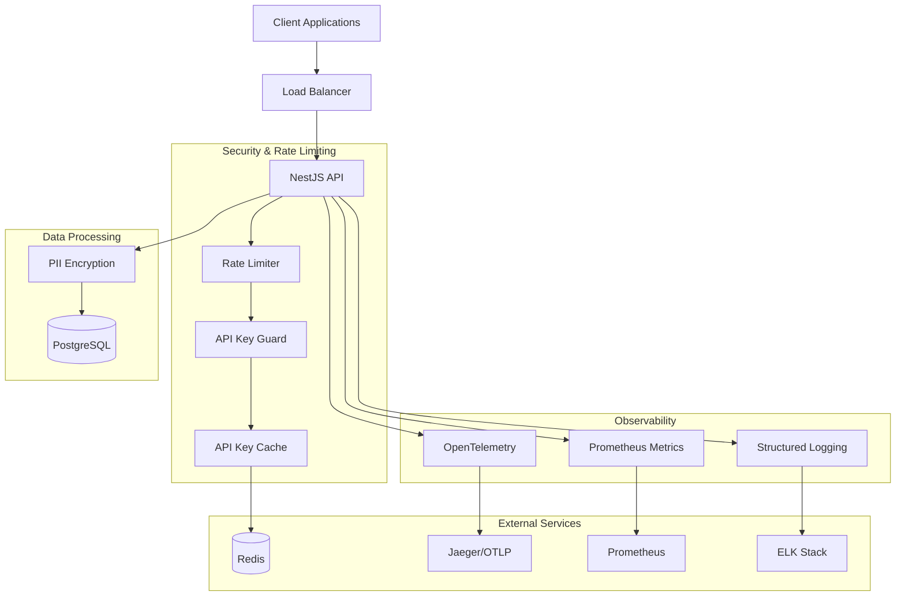
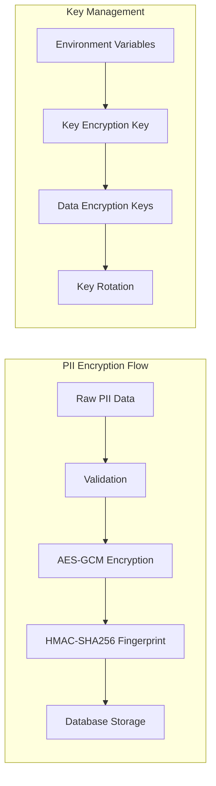

# Design Document

## Overview

This design implements pragmatic security hardening and production observability for the Mercurio analytics platform. The goal is to add PII encryption, basic rate limiting, tracing and metrics with low operational overhead, deferring advanced infrastructure until required.

The design follows a layered approach:
- **Security Layer**: PII encryption, secure key management, and enhanced authentication
- **Rate Limiting Layer**: Multi-tenant rate limiting with in-memory default and optional Redis adapter
- **Observability Layer**: OpenTelemetry tracing, Prometheus metrics, and structured logging
- **Data Quality Layer**: Event validation monitoring and error categorization

## Architecture

### High-Level Architecture



### Security Architecture (right-sized)



## Components and Interfaces

### 1. PII Encryption Service (MVP)

**Purpose**: Encrypt sensitive user data (emails, phone numbers) and generate searchable fingerprints.

```typescript
interface EncryptionService {
  encryptEmail(email: string): Promise<EncryptedPII>;
  encryptPhone(phone: string): Promise<EncryptedPII>;
  decryptEmail(encryptedData: string): Promise<string>;
  decryptPhone(encryptedData: string): Promise<string>;
  generateFingerprint(data: string, type: 'email' | 'phone'): string;
  // Rotation supported via keyVersion; automation deferred in this sprint
  rotateKeys(): Promise<void>;
}

interface EncryptedPII {
  encrypted: string;
  fingerprint: string;
  keyVersion: number;
}
```

**Implementation Details**:
- AES-256-GCM (authenticated encryption)
- HMAC-SHA256 for fingerprints with separate secrets por tipo
- Key versioning para suportar rotação (procedimento manual neste sprint)
- Key management via variáveis de ambiente (KEK/DEK)

### 2. Rate Limiting Service (MVP)

**Purpose**: Implement per-tenant rate limiting with in-memory token bucket; Redis opcional quando infra disponível.

```typescript
interface RateLimitService {
  checkLimit(tenantId: string, endpoint: string): Promise<RateLimitResult>;
  incrementUsage(tenantId: string, endpoint: string): Promise<void>;
  getRemainingQuota(tenantId: string, endpoint: string): Promise<number>;
  resetTenantLimits(tenantId: string): Promise<void>;
}

interface RateLimitResult {
  allowed: boolean;
  remaining: number;
  resetTime: Date;
  retryAfter?: number;
}
```

**Implementation Details**:
- Token bucket com limites por tier/endpoint
- In-memory por padrão (conservador); adapter Redis opcional (Lua/cluster deferido)
- Categorias separadas (events, queries, admin)

### 3. Enhanced API Key Cache

**Purpose**: Extend existing cache with shorter TTL and better invalidation.

```typescript
interface EnhancedApiKeyCache extends ApiKeyService {
  validateKeyWithShortTTL(apiKey: string): Promise<ApiKeyValidationResult>;
  invalidateKey(apiKeyId: bigint): Promise<void>;
  preloadTenantKeys(tenantId: string): Promise<void>;
  getCacheMetrics(): CacheMetrics;
}

interface CacheMetrics {
  hitRate: number;
  avgLatency: number;
  evictionRate: number;
  size: number;
}
```

**Implementation Details**:
- Reduces TTL from 5 minutes to 60 seconds for security
- Implements cache warming for high-traffic tenants
- Adds cache metrics for monitoring
- Supports immediate invalidation on key revocation

### 4. OpenTelemetry Integration (MVP)

**Purpose**: Implement distributed tracing with configurable sampling.

```typescript
interface TracingService {
  startSpan(name: string, attributes?: Record<string, any>): Span;
  addEvent(span: Span, name: string, attributes?: Record<string, any>): void;
  setSpanStatus(span: Span, status: SpanStatus): void;
  injectTraceContext(headers: Record<string, string>): void;
  extractTraceContext(headers: Record<string, string>): SpanContext | null;
}

interface TracingConfig {
  serviceName: string;
  version: string;
  environment: string;
  samplingRate: number;
  exporterEndpoint: string;
}
```

**Implementation Details**:
- OpenTelemetry SDK com exporter OTLP
- Sampling configurável (1–5% inicialmente)
- Auto-instrumentation para HTTP e banco de dados
- Spans customizados (event processing, encryption)

### 5. Enhanced Metrics Service

**Purpose**: Extend existing metrics with security and observability data.

```typescript
interface EnhancedMetricsService extends MetricsService {
  recordRateLimitHit(tenantId: string, endpoint: string): void;
  recordEncryptionOperation(operation: 'encrypt' | 'decrypt', type: 'email' | 'phone'): void;
  recordDataQualityEvent(event: DataQualityEvent): void;
  recordCacheOperation(operation: 'hit' | 'miss' | 'eviction', cacheType: string): void;
}

interface DataQualityEvent {
  type: 'validation_failure' | 'duplicate_detected' | 'schema_error';
  reason: string;
  tenantId: string;
  eventName?: string;
}
```

### 6. Data Quality Monitor (metrics-only)

**Purpose**: Track and categorize data processing issues.

```typescript
interface DataQualityMonitor {
  recordRejection(reason: string, context: ProcessingContext): void;
  sampleDiscardedEvent(event: any, reason: string): void;
  getQualityMetrics(tenantId?: string): QualityMetrics;
  generateQualityReport(timeRange: TimeRange): QualityReport;
}

interface QualityMetrics {
  totalEvents: number;
  rejectedEvents: number;
  rejectionReasons: Record<string, number>;
  validationFailureRate: number;
  duplicateRate: number;
}
```

## Data Models

### Enhanced Database Schema

```sql
-- Add encryption key version tracking
ALTER TABLE lead ADD COLUMN email_key_version INTEGER DEFAULT 1;
ALTER TABLE lead ADD COLUMN phone_key_version INTEGER DEFAULT 1;

-- Rate limiting: sem tabelas (in-memory/Redis). DB não é usado para buckets.

-- Data quality persistence deferida; iniciar com métricas Prometheus e amostragem de logs
```

### Configuration Schema

```typescript
interface SecurityConfig {
  encryption: {
    algorithm: 'aes-256-gcm';
    keyRotationDays: number;
    kekSecret: string;
    emailDekSecret: string;
    phoneDekSecret: string;
    fingerprintSecrets: {
      email: string;
      phone: string;
    };
  };
  
  rateLimiting: {
    redis: {
      enabled: boolean;
      url: string;
      keyPrefix: string;
    };
    limits: {
      [tenantTier: string]: {
        events: { requests: number; windowMs: number };
        queries: { requests: number; windowMs: number };
        admin: { requests: number; windowMs: number };
      };
    };
  };
  
  observability: {
    tracing: {
      enabled: boolean;
      serviceName: string;
      samplingRate: number;
      exporterUrl: string;
    };
    metrics: {
      enabled: boolean;
      port: number;
      path: string;
    };
  };
}
```

## Error Handling

### Error Classification System

```typescript
enum ErrorCategory {
  SECURITY = 'security',
  RATE_LIMIT = 'rate_limit',
  VALIDATION = 'validation',
  ENCRYPTION = 'encryption',
  SYSTEM = 'system',
  EXTERNAL = 'external'
}

interface ClassifiedError {
  category: ErrorCategory;
  code: string;
  message: string;
  severity: 'low' | 'medium' | 'high' | 'critical';
  retryable: boolean;
  context: Record<string, any>;
}
```

### Error Handling Strategy

1. **Security Errors**: Log with high severity, trigger alerts, never expose details
2. **Rate Limit Errors**: Return 429 with retry-after header, log for capacity planning
3. **Validation Errors**: Return 400 with sanitized details, track for data quality
4. **Encryption Errors**: Log as critical, fallback to plaintext with warning (if configured)
5. **System Errors**: Return 500, log with full context, trigger alerts

## Testing Strategy

### Unit Testing

- **Encryption Service**: Test encryption/decryption, key rotation, fingerprint generation
- **Rate Limiting**: Test token bucket algorithm, Redis fallback, tenant isolation
- **Caching**: Test TTL behavior, invalidation, metrics collection
- **Tracing**: Test span creation, context propagation, sampling
- **Data Quality**: Test event categorization, sampling logic

### Integration Testing

- **End-to-End Security**: Test PII encryption through full request lifecycle
- **Rate Limiting Integration**: Test multi-tenant scenarios with Redis
- **Observability Pipeline**: Test trace/metric/log correlation
- **Cache Invalidation**: Test immediate invalidation on key revocation
- **Failover Scenarios**: Test Redis failover, degraded mode operation

### Performance Testing

- **Encryption Overhead**: Measure impact on request latency
- **Rate Limiting Performance**: Test under high concurrent load
- **Cache Performance**: Measure hit rates and latency impact
- **Tracing Overhead**: Validate sampling reduces performance impact
- **Memory Usage**: Monitor memory consumption under load

### Security Testing

- **Key Rotation**: Test zero-downtime key rotation procedures
- **PII Exposure**: Verify no plaintext PII in logs or error messages
- **Rate Limit Bypass**: Test for potential bypass vulnerabilities
- **Cache Timing**: Test for timing attack vulnerabilities
- **Secret Management**: Verify secrets are never logged or exposed

## Monitoring and Alerting

### Key Metrics

1. **Performance Metrics**:
   - Request latency P50, P95, P99
   - Encryption operation latency
   - Cache hit rates and latency
   - Rate limiting overhead

2. **Security Metrics**:
   - Failed authentication attempts
   - Rate limit violations per tenant
   - Encryption/decryption error rates
   - Key rotation success/failure

3. **Data Quality Metrics**:
   - Event rejection rates by reason
   - Validation failure rates
   - Duplicate detection rates
   - Schema version usage

4. **System Health Metrics**:
   - Memory usage and GC pressure
   - Database connection pool utilization
   - Redis connection health
   - Trace export success rates

### Alert Conditions

1. **Critical Alerts**:
   - P95 latency > 120ms for 5 minutes
   - Error rate > 1% for 2 minutes
   - Encryption service failures
   - Redis cluster failures

2. **Warning Alerts**:
   - Cache hit rate < 80%
   - Rate limit violations > 100/minute
   - Memory usage > 80%
   - Trace export failures

3. **Info Alerts**:
   - Key rotation events
   - Tenant provisioning events
   - Configuration changes

### Dashboard Requirements

1. **Operations Dashboard**:
   - Real-time request metrics
   - Error rates and types
   - System resource usage
   - Cache performance

2. **Security Dashboard**:
   - Authentication metrics
   - Rate limiting status
   - PII encryption health
   - Key rotation status

3. **Data Quality Dashboard**:
   - Event processing metrics
   - Rejection reasons breakdown
   - Tenant-specific quality scores
   - Schema version adoption

## Deployment Considerations

### Environment Variables

```bash
# Encryption
ENCRYPTION_KEK_SECRET=<base64-encoded-key>
EMAIL_DEK_SECRET=<base64-encoded-key>
PHONE_DEK_SECRET=<base64-encoded-key>
EMAIL_FINGERPRINT_SECRET=<base64-encoded-secret>
PHONE_FINGERPRINT_SECRET=<base64-encoded-secret>

# Rate Limiting
REDIS_URL=redis://localhost:6379
RATE_LIMIT_REDIS_PREFIX=mercurio:ratelimit:
RATE_LIMIT_FALLBACK_ENABLED=true

# Observability
OTEL_SERVICE_NAME=mercurio-api
OTEL_EXPORTER_OTLP_ENDPOINT=http://jaeger:4317
OTEL_SAMPLING_RATE=0.05
METRICS_PORT=9090

# API Key Cache
API_KEY_CACHE_TTL=60000
```

### Infrastructure Requirements

1. **Redis Cluster**: For distributed rate limiting and caching
2. **Jaeger/OTLP Collector**: For trace collection and export
3. **Prometheus**: For metrics collection and alerting
4. **Grafana**: For dashboards and visualization
5. **ELK Stack**: For log aggregation and analysis

### Security Considerations

1. **Secret Rotation**: Implement automated key rotation procedures
2. **Network Security**: Encrypt all inter-service communication
3. **Access Control**: Restrict access to encryption keys and Redis
4. **Audit Logging**: Log all security-related events
5. **Compliance**: Ensure GDPR/CCPA compliance for PII handling
